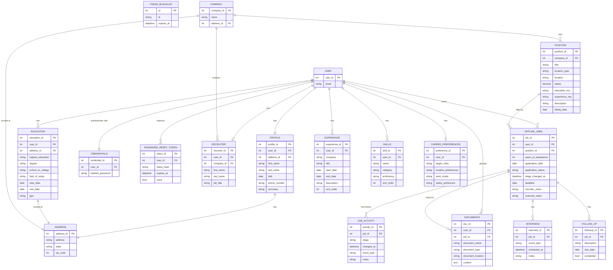

```mermaid
erDiagram
  USER {
    int user_id PK
    string email
  }
  PROFILE {
    int profile_id PK
    int user_id FK
    int address_id FK
    string first_name
    string last_name
    date dob
    string phone_number
    string summary
  }
  ADDRESS {
    int address_id PK
    string address
    string state
    int zip_code
  }
  EDUCATION {
    int education_id PK
    int user_id FK
    int address_id FK
    string highest_education
    string degree
    string school_or_college
    string field_of_study
    date start_date
    date end_date
    string gpa
  }
  DOCUMENTS {
    int doc_id PK
    int user_id FK
    int job_id FK
    string document_name
    string document_type
    string document_location
    text content
  }
  CREDENTIALS {
    int credential_id PK
    int user_id FK
    string hashed_password
  }
  PASSWORD_RESET_TOKEN {
    int token_id PK
    int user_id FK
    string token_hash
    datetime expires_at
    bool used
  }
  TOKEN_BLACKLIST {
    int id PK
    string jti
    datetime expires_at
  }
  COMPANY {
    int company_id PK
    string name
    int address_id FK
  }
  RECRUITER {
    int recruiter_id PK
    int user_id FK
    int company_id FK
    string first_name
    string last_name
    string job_title
  }
  POSITION {
    int position_id PK
    int company_id FK
    string title
    string location_type
    string location
    decimal salary
    string education_req
    string experience_req
    string description
    date listing_date
  }
  APPLIED_JOBS {
    int job_id PK
    int user_id FK
    int position_id FK
    int years_of_experience
    date application_date
    string application_status
    datetime stage_changed_at
    date deadline
    string recruiter_notes
    string outcome_notes
  }
  JOB_ACTIVITY {
    int activity_id PK
    int job_id FK
    string stage
    datetime changed_at
    string event_type
    string notes
  }
  INTERVIEW {
    int interview_id PK
    int job_id FK
    string round_type
    datetime scheduled_at
    string notes
  }
  FOLLOW_UP {
    int followup_id PK
    int job_id FK
    string description
    date due_date
    bool completed
  }
  EXPERIENCE {
    int experience_id PK
    int user_id FK
    string company
    string title
    date start_date
    date end_date
    string description
    int sort_order
  }
  SKILLS {
    int skill_id PK
    int user_id FK
    string name
    string category
    string proficiency
    int sort_order
  }
  CAREER_PREFERENCES {
    int preference_id PK
    int user_id FK
    string target_roles
    string location_preferences
    string work_mode
    string salary_preference
  }

  USER ||--|| PROFILE : "has"
  USER ||--|| CREDENTIALS : "authenticates with"
  USER ||--o{ PASSWORD_RESET_TOKEN : "requests"
  PROFILE ||--|| ADDRESS : "has"
  USER ||--o{ EDUCATION : "has"
  USER ||--o{ DOCUMENTS : "uploads"
  USER ||--o{ APPLIED_JOBS : "tracks"
  USER ||--o{ EXPERIENCE : "has"
  USER ||--o{ SKILLS : "has"
  USER ||--o| CAREER_PREFERENCES : "has"
  USER ||--o| RECRUITER : "has"
  COMPANY ||--o{ RECRUITER : "employs"
  COMPANY ||--o{ POSITION : "lists"
  POSITION ||--o{ APPLIED_JOBS : "filled by"
  APPLIED_JOBS ||--o{ JOB_ACTIVITY : "has history"
  APPLIED_JOBS ||--o{ INTERVIEW : "has"
  APPLIED_JOBS ||--o{ FOLLOW_UP : "has"
  APPLIED_JOBS ||--o{ DOCUMENTS : "linked to"
  EDUCATION ||--|| ADDRESS : "located at"
  COMPANY ||--|| ADDRESS : "located at"
```
