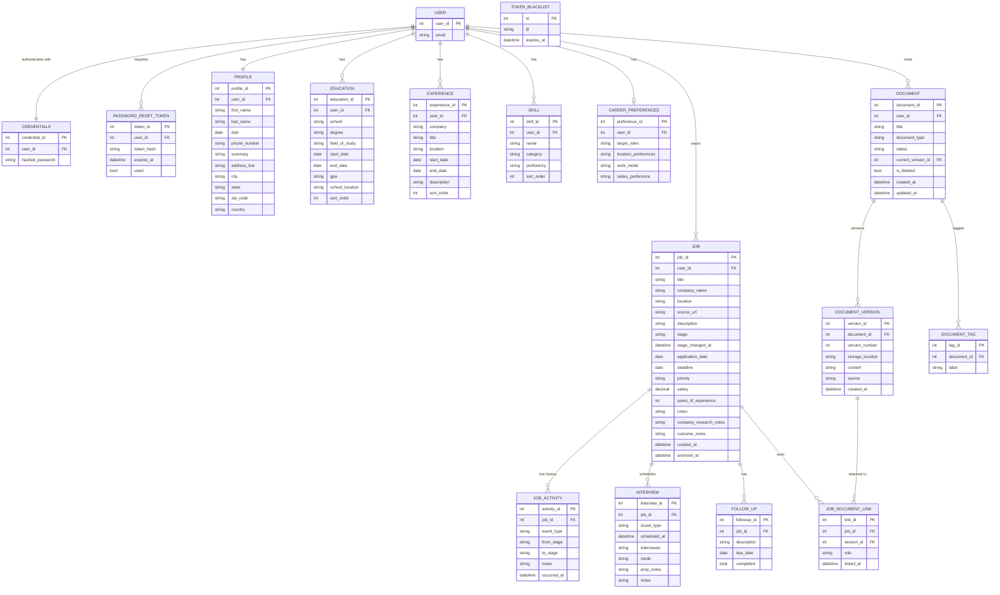

## Design notes

This schema reflects the candidate-facing model from [PURPOSE.md](PURPOSE.md): a single-user, private job-search workspace. Every record is account-scoped via `user_id`. There is no cross-user visibility and no shared catalog of companies or postings.

### Removed from prior schema
- **`COMPANY`** — companies are free-text strings on the `JOB` row. AI "company research" in Sprint 3 is generated text, not a shared directory.
- **`POSITION`** — there is no employer-owned listing. A `JOB` is the user's own opportunity record.
- **`APPLIED_JOBS`** — collapsed into `JOB`. "Applications" and "jobs" are the same thing now (PURPOSE.md §3 mental-model table).
- **`RECRUITER`, `RECRUITER_CREDENTIALS`, `RECRUITER_PASSWORD_RESET_TOKEN`** — no second user role.
- **`ADDRESS`** — denormalized onto `PROFILE`/`EDUCATION`/`EXPERIENCE`. The address table existed mostly to share rows with `COMPANY`; without that, the join cost has no payoff for a single-user app.

### Key changes
- **`JOB`** owns `company_name`, `location`, `source_url`, `description` directly. `application_date` is nullable (Interested-stage jobs aren't applied yet).
- **`DOCUMENT` / `DOCUMENT_VERSION` / `JOB_DOCUMENT_LINK`** support N:N between jobs and document *versions*, with version history per document. `DOCUMENT.current_version_id` lets the library show the latest version without scanning. `JOB_DOCUMENT_LINK.role` distinguishes resume vs. cover-letter attachment.
- **`JOB_ACTIVITY`** gains `from_stage`/`to_stage` so the timeline can render transitions, not just snapshots.
- **`SKILLS` → `SKILL`** for naming consistency.

### Tradeoff
Free-text `company_name` means "Google" and "google inc" won't auto-merge. Acceptable for a personal tracker; if per-company grouping is needed later, add a per-user `COMPANY_REF` table — *not* a shared one.
